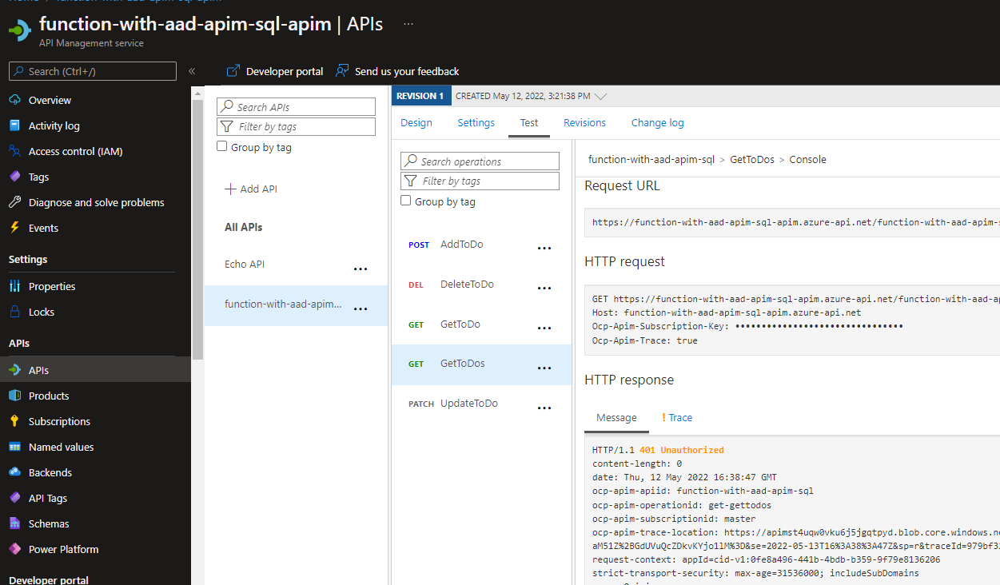
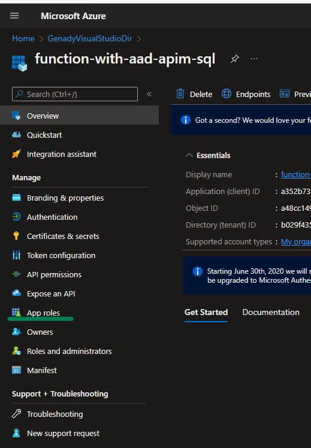

# Create an identity-protected API implementation with Azure Functions, Azure SQL and API Management 


This step-by-step tutorial will implement architecture above and contain the follwing steps:

- Create Azure Functions in VS Code
- Create SQL Database and add SQL Bindings to the Functions. This repo enhances [this sample](https://docs.microsoft.com/en-us/samples/azure-samples/azure-sql-binding-func-dotnet-todo/todo-backend-dotnet-azure-sql-bindings-azure-functions/)
- Deploy Azure Function into Azure
- Expose the API through the API management
- Protect Back-End API through AAD so that only this APIM instance can access the back-end API
- Protect exposed API through APIM API Keys for the external developers
- Test access to the exposed API through the developer portal
- Optional. Protect access to Azure SQL through AAD while using Functions. [Based on this ](https://docs.microsoft.com/en-us/azure/azure-functions/functions-identity-access-azure-sql-with-managed-identity) and [this tutorial](https://docs.microsoft.com/en-us/azure/azure-functions/functions-identity-access-azure-sql-with-managed-identity) 

Audience: teams exploring new generation cloud services implementation concepts

Reason for this tutorial: focus more on the complete business solution rather than on separate services

## Scenario description

Contoso ToDo Product team has already migrated a couple of their applications into Azure App Service. These applications are using custom implemented Authentication and Authorization. They have heard about Microsoft Zero Trust concept and would like to protect their externally exposed APIs, API back-end and the Azure SQL data.

The team would like to increase developer velocity while using serverless technologies such as Azure Functions

## Create Azure Functions in VS Code

Please refer to this [existing tutorial](https://docs.microsoft.com/en-us/azure/azure-functions/functions-develop-vs-code?tabs=csharp) and create the following Functions:

* AddToDo
* DeleteToDo
* GetToDo
* GetToDos
* UpdateToDo

All these Functions will be using HTTP Trigger and also different HTTP Methods

Replace the generated Functions code with the content in the [branch](https://github.com/gbelenky/function-with-aad-apim-sql/tree/Step-1--Create-Functions) of this repo

Install [HTTP REST Client](https://marketplace.visualstudio.com/items?itemName=humao.rest-client), start the Function and run the tests on your local machine by using the [sample requests](test.http)

The test samples for them are here:
[sample](test.http)


## Create the SQL Database and tables

Use this [quickstart](https://docs.microsoft.com/en-us/azure/azure-sql/database/single-database-create-quickstart) to create your database - do not add sample data to your database as it is descibed in the tutorial

Select the Query Editor in your newly created database and execute [this script](/sql/create.sql) there:


Add .NET packages for Azure Functions SQL binding as [referred here](https://www.nuget.org/packages/Microsoft.Azure.WebJobs.Extensions.Sql)

Open VSCode terminal and execute there 

```
dotnet add package Microsoft.Azure.WebJobs.Extensions.Sql --version 0.1.311-preview

```

Start adding bindings to the code - start with [AddToDo.cs](AddToDo.cs)


You also need to update your local.settings.json file configuring the SQLConnectionString


Replace your code by the content here [AddToDo.cs](AddToDo.cs), run the Function project and call the function from the [test.http](test.http) and observe the results


Continue with the [GetToDo.cs](GetToDo.cs), [GetToDos.cs](GetToDos.cs), [DeleteToDo.cs](DeleteToDo.cs) and [UpdateToDo.cs](UpdateToDo.cs)

Test the rest of the functions with  [test.http](test.http)

## Deploy Azure Functions
Please refer [to this document](https://docs.microsoft.com/en-us/azure/azure-functions/functions-develop-vs-code?tabs=csharp#enable-publishing-with-advanced-create-options) for the detailed deployment information 


Upload local settings:


Verify the deployment in the Azure Portal


Verify your local settings were published. In my case I had to add the SQLConnectionString manually 


Test your deployed Function


You can test all your functions from the Azure Portal or add corresponding requests to the test.http file. You can find the Function URL here:


In my case it is https://function-with-aad-apim-sql.azurewebsites.net/api/GetToDos

## Expose the API through the API management

Create a new API management instance:


Create Managed Identity for your API Management


Optionally add Application Insights to your API Management


Review and Create your API Management. This will take some minutes to be completed.

Select the APIM resource you jut creted, go to the APIs blade and select "Create from Azure Resource" - "Function App"


Search and select your Function App


Select and import all Functions from your Function App


Click "Create"


After the import you will land in the Design Blade of the APIM


Test access to your backend API from the APIM


As you can see here, your API is already protected by the automatically generated key:


Now, we need to protect the backend API so that only APIM is able to access it.

### Step 1. Configure authentication for your Functions App

Go to your Function App and select the Authentication blade:


Select Microsoft


Click Add


Note App (client) Id

Try to access your back-end now:


and this is the result


when testing the Function from APIM you will get the same result:



there is a different picture when testing in the browser:


This means that we limited access to the back-end API only to the indentities inside of the Azure AD tenant where we created identity of the Azure Function (also called Managed Identity describing the Service Principal which was also instantiated in the same AAD Tenant). But still, all identities can access our Function - we need to change it


### Step 2. Allow APIM to access the Function

Before we limit access to the backend, we need to allow APIM to access our Function. [The following policy will help us](https://docs.microsoft.com/en-us/azure/api-management/api-management-authentication-policies#use-managed-identity-to-authenticate-with-a-backend-service) to the APIM

```
<authentication-managed-identity resource="Client_id_of_Backend"/>

```

If you did not note the Client Id of your Function, you need to revisit the Authentication blade of the Function:


Jump back to APIM and select your API:

Click Inbound Processing -> Policies


Add the following line and replace the resource with your Azure Function Client Id:


Save it and test your API again:

Our request was successful:


### Step 3. Allow ONLY APIM to access the Function

If you're unfamiliar with managed identities for Azure resources, check out the [overview section](https://docs.microsoft.com/en-us/azure/active-directory/managed-identities-azure-resources/overview). 

Be sure to review the [difference between a system-assigned and user-assigned managed identity](https://docs.microsoft.com/en-us/azure/active-directory/managed-identities-azure-resources/overview#managed-identity-types). 

Here you can find more information on [Service Principals and Applications](https://docs.microsoft.com/en-us/azure/active-directory/develop/app-objects-and-service-principals)

To limit access to APIM only you need to 
- Create an App Role for your Function in its AAD registration (this will be correlated with the Service Principal of your AAD App Registration). App Role defines a group of users/applications anabled to access this application and receive receive this App Role as an authorization claim (outside of scope here. More [here](https://docs.microsoft.com/en-us/azure/active-directory/develop/howto-add-app-roles-in-azure-ad-apps#usage-scenario-of-app-roles)) 
- Add the APIM Managed Identity Object ID to the App Role
- [Limit access to the Function only to the users/roles in the App Role](https://docs.microsoft.com/en-us/azure/active-directory/develop/howto-restrict-your-app-to-a-set-of-users#update-the-app-to-require-user-assignment) 

A similar approach can be achieved by using [Security Groups](https://docs.microsoft.com/en-us/azure/active-directory/develop/howto-add-app-roles-in-azure-ad-apps#app-roles-vs-groups), but might evolve IT personnel managing AAD Security Groups. Here, we will work through the App Roles.

Go to the application registrations:


select your function:



Create a new App Role:


Currently you cannot assign your APIM Application identity to the app role through the Azure Portal. You will need to go through the [Azure CLI](https://docs.microsoft.com/en-us/azure/active-directory/managed-identities-azure-resources/how-to-assign-app-role-managed-identity-cli) or [Powershell](https://docs.microsoft.com/en-us/azure/active-directory/managed-identities-azure-resources/how-to-assign-app-role-managed-identity-powershell).


Use the Bash environment in [Azure Cloud Shell](https://docs.microsoft.com/en-us/azure/cloud-shell/quickstart). For more information, see [Azure Cloud Shell Quickstart - Bash](https://docs.microsoft.com/en-us/azure/cloud-shell/quickstart).

[Launch Cloud Shell in a new window](https://shell.azure.com/)

This is the commandlet you will need to execute:
```
# Assign the managed identity access to the app role.
New-AzureADServiceAppRoleAssignment -ObjectId $APIMmanagedIdentityObjectId -Id $appRoleId -PrincipalId $APIMmanagedIdentityObjectId -ResourceId $functionServicePrincipalObjectId

```
functionServicePrincipalObjectId : 


Go to the AAD Enterprise Applications


Copy the Object Id


appRoleId : 

Go to AAD App registrations, select your registration and the App Role. Copy the App Role Id


APIMmanagedIdentityObjectId:

Go to APIM - search for managed identity and copy the Object Principal id :


Set these values in Powershell and execute the commandlet:

```
# Enterprise applications 
$functionServicePrincipalObjectId = '15b**********'
# App Role Id
$appRoleId = '78b**********'
# APIM Managed Identity
$APIMmanagedIdentityObjectId = '891******'

# Assign the managed identity access to the app role.
New-AzureADServiceAppRoleAssignment -ObjectId $APIMmanagedIdentityObjectId -Id $appRoleId -PrincipalId $APIMmanagedIdentityObjectId -ResourceId $functionServicePrincipalObjectId

```

And this is [the last step](https://docs.microsoft.com/en-us/azure/active-directory/develop/howto-restrict-your-app-to-a-set-of-users#update-the-app-to-require-user-assignment)


Verify that you have no access to the function directly 


And that you have access through the APIM:


